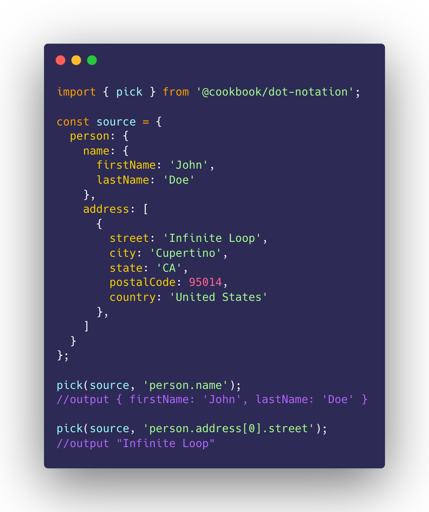

# @cookbook/dot-notation
> Object readings and complex transformations made easy by using `dot.notation.syntax[]`

[![NPM Version][npm-image]][npm-url]
[![CI Status][circleci-image]][circleci-url]
[![Downloads Stats][npm-downloads]][npm-url]
[![GitHub stars][stars-image]][stars-url]
[![Known Vulnerabilities][vulnerabilities-image]][vulnerabilities-url]
[![GitHub issues][issues-image]][issues-url]
[![Awesome][awesome-image]][awesome-url]
[![install size][install-size-image]][install-size-url]
[![gzip size][gzip-size-image]][gzip-size-url]



## Demo

Play around with _dot-notation_ and experience **the magic**!

[](https://codesandbox.io/s/cookbookdot-notation-kjwd2?fontsize=14&hidenavigation=1&theme=dark)

## Installation

```sh
npm install @cookbook/dot-notation --save
#or
yarn add @cookbook/dot-notation
```

## How to use

### Picking a value

```js
import dot from '@cookbook/dot-notation';

const source = {
  person: {
    name: {
      firstName: 'John',
      lastName: 'Doe'
    },
    address: [
      {
        street: 'Infinite Loop',
        city: 'Cupertino',
        state: 'CA',
        postalCode: 95014,
        country: 'United States'
      },
    ]
  }
};

dot.pick(source, 'person.name');
//outputs { firstName: 'John', lastName: 'Doe' }

dot.pick(source, 'person.address[0].street');
//outputs "Infinite Loop"
```

### Parsing an object

#### Conventional parsing

```js
import dot from '@cookbook/dot-notation';

const source = {
  'person.name.firstName': 'John',
  'person.name.lastName': 'Doe',
  'person.address[].street': 'Infinite Loop',
  'person.address[].city': 'Cupertino',
  'person.address[].postalCode': 95014,
};

dot.parse(source);

/* outputs
{
  person: {
    name: {
      firstName: 'John',
      lastName: 'Doe',
    },
    address: [
      {
        street: 'Infinite Loop',
        city: 'Cupertino',
        postalCode: 95014,
      },
    ],
  },
}
*/
```

#### With nested array

> where `[n]` represents the array index position to insert the element

```js
import dot from '@cookbook/dot-notation';

const source = {
  '[0].street': 'Infinite Loop',
  '[0].city': 'Cupertino',
  '[0].postalCode': 95014,
  '[1].street': '1600 Amphitheatre',
  '[1].city': 'Mountain View',
  '[1].postalCode': 94043,
  '[2][0]': 'hobbies',
  '[2][1][0]': ['coding'],
  '[2][1][1]': ['gaming'],
};

dot.parse(source);

/* outputs
[
 {
  "postalCode": 95014,
  "city": "Cupertino",
  "street": "Infinite Loop"
 },
 {
  "postalCode": 94043,
  "city": "Mountain View",
  "street": "1600 Amphitheatre"
 },
 [
  "hobbies",
  [["coding"],["gaming"]]
 ]
]
*/
```

### Parsing single key


```js
import dot from '@cookbook/dot-notation';

const path = 'person.name';
const value = 'John Doe';

dot.parseKey(path, value);

/* outputs
{
  person: {
    name: 'John Doe',
  },
}
*/
```

<!-- Markdown link & img dfn's -->
[npm-image]: https://img.shields.io/npm/v/@cookbook/dot-notation.svg?style=flat-square
[npm-url]: https://npmjs.org/package/@cookbook/dot-notation
[npm-downloads]: https://img.shields.io/npm/dm/@cookbook/dot-notation.svg?style=flat-square
[circleci-image]: https://circleci.com/gh/the-cookbook/dot-notation.svg?style=svg
[circleci-url]: https://circleci.com/gh/the-cookbook/dot-notation
[stars-image]: https://img.shields.io/github/stars/the-cookbook/dot-notation.svg
[stars-url]: https://github.com/the-cookbook/dot-notation/stargazers
[vulnerabilities-image]: https://snyk.io/test/github/the-cookbook/dot-notation/badge.svg
[vulnerabilities-url]: https://snyk.io/test/github/the-cookbook/dot-notation
[issues-image]: https://img.shields.io/github/issues/the-cookbook/dot-notation.svg
[issues-url]: https://github.com/the-cookbook/dot-notation/issues
[awesome-image]: https://cdn.rawgit.com/sindresorhus/awesome/d7305f38d29fed78fa85652e3a63e154dd8e8829/media/badge.svg
[awesome-url]: https://github.com/the-cookbook/dot-notation
[install-size-image]: https://packagephobia.now.sh/badge?p=@cookbook/dot-notation
[install-size-url]: https://packagephobia.now.sh/result?p=@cookbook/dot-notation
[gzip-size-image]: http://img.badgesize.io/https://unpkg.com/@cookbook/dot-notation/lib/dot.min.js?compression=gzip
[gzip-size-url]: https://unpkg.com/@cookbook/dot-notation/lib/dot.min.js
